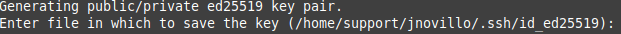
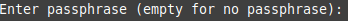
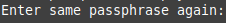

## Installing Git
**Mac and Linux:** Git should be installed already.

Windows: Install git and the shell gitbash from [here](https://gitforwindows.org/). This includes git, gitbash, and has shell integration so that you can right-click on a folder in Windows Explorer to access gitbash at that location.

## Git commands
**The git config command:** Configuring user information used across all local repositories. The following commands set a name and an email address that are associated with each version history.

```
git config --global user.name "YOUR_NAME_HERE"
git config --global user.email YOUR_EMAIL_HERE
```

The basic commands we are going to use in this class are:

- **git clone:** Retrieve an entire repository from a hosted location via URL.
- **git pull:** Fetch and merge any commits from the tracking remote branch.
- **git add:** Add a file as it looks now to your next commit (stage).
- **git commit:** Commit your staged content as a new commit snapshot.
- **git push:** Transmit local branch commits to the remote repository branch.
- **git diff:** Displays diff of what is changed but not staged.

You may take a look at the git reference [sheet](https://education.github.com/git-cheat-sheet-education.pdf).

## Connect to GitHub with SSH

If you do not have a GitHub account, create one please [GitHub](https://github.com/) (you may use any email to create your GitHub account).

Then, follow these steps to create an ssh key, connect to GitHub using SSH, and clone your repository.

1. Create your ssh key: Open your terminal and type

    `ssh-keygen -t ed25519`

It will ask you to enter a file in which to save the key. **Do not type anything, just press `Enter`**. The keys will be saved in the default path that it is displayed between parenthesis:
   


Then, it will ask you to enter a passphrase. Notice when you type this passpharase, it will not show up but you are typing. When you are done hit `Enter`:



Finally, it will ask you to enter the passphrase again to confirm:


    
Check if your keys were generated:
    
`cd .ssh/` => Normally, this is the defauld path. Double check the path were the keys were saved in the previous steps.
    
`ls` => If using Windows and `ls` does not exist, try `dir`.
        
You should see your private key (`id_ed25519`) and public key (`id_ed25519.pub`) inside that directory.

2. Log in to your GitHub account.

    Click on your profile picture (right-top). You will see a menu; click on [Settings](https://github.com/settings/keys).

    You will see a menu on the left. Click on SSH and GPG keys and click on Add New SSH key.

    You will give a title to that key. The key type should be "Authentication Key" and copy your public key (the content inside the file id_ed25519.pub) in the field "Key". Make sure you do not add spaces or blank lines.

3. Go to the following [link](https://docs.github.com/en/authentication/connecting-to-github-with-ssh/testing-your-ssh-connection) and test your SSH connection.

4. Let's clone your repository on your local computer:

    Go to your assignments repository that you accepted for this class in GitHub (assignments repo must be accepted only once, check GC for to have the link). You will see a green button, "Code". You must click on that button and select SSH to have the appropriate link that will allow you to clone your repository and copy the link you see there./

5. Create a folder `CS_Foundations` anywhere in your computer.
   
6. On your terminal, go inside the folder `CS_Foundations` to clone your repository and type:
    ```
    git clone PASTE_THE_LINK_YOU_COPIED_FROM_GITHUB_(git@...)
    ```

7. Go inside the folder that appears after you execute the clone command, and you will see the files you have on your GitHub repository.
